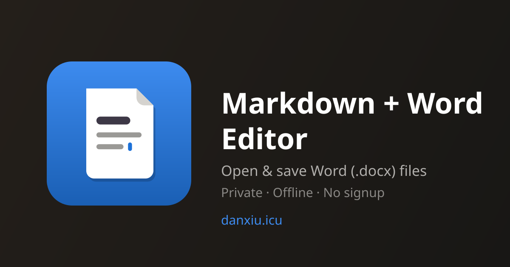

# Markdown + Word Editor

A free, private markdown editor that runs entirely in your browser — and speaks Word.

**Try it: https://danxiu.icu**

## Features

- **Markdown ↔ Word round-trip** — open a `.docx` and edit it as markdown, then export back to `.docx`
- **Live preview with synchronized scrolling** — the preview follows the editor, and vice versa
- **Private by design** — files are opened and saved locally via the File System Access API; nothing is uploaded, no account needed
- **Works offline** — installable PWA with a service worker; the whole app shell is cached
- **Unsaved-changes protection** — warns before you close a tab with unsaved work
- **Dark / light themes**

## Tech

Single-page app, no build step. Uses [marked](https://marked.js.org/) for markdown rendering, [mammoth](https://github.com/mwilliamson/mammoth.js) for `.docx` import, [docx.js](https://docx.js.org/) for `.docx` export, and a vendored copy of `pretext` for text layout (see `vendor/pretext/`).

## Deployment

Pushing to `master` triggers the GitHub Actions workflow in `.github/workflows/deploy.yml`, which rsyncs the site to the web server.
